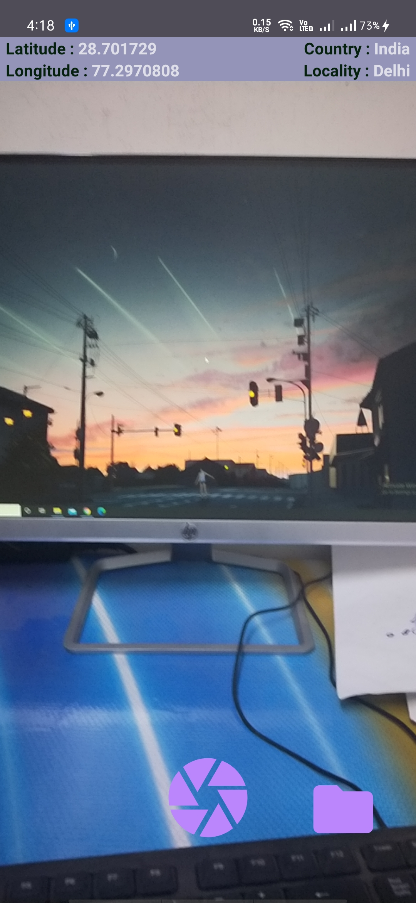
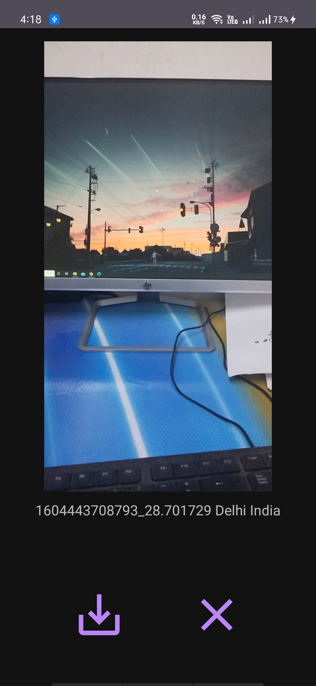

# CameraCL

- **It uses CameraX api to capture images.**

 

- **It shows location of captured image and preview of captured image so user can save image in SQLite Database or click again.**

 

 - **And location coordinates saved as image name in database.**
