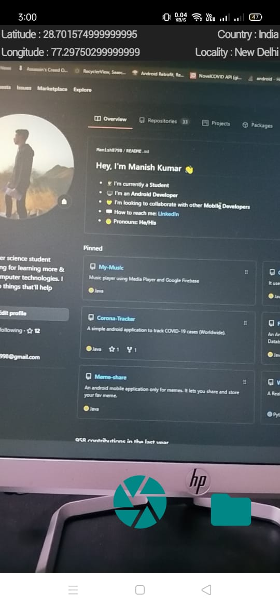
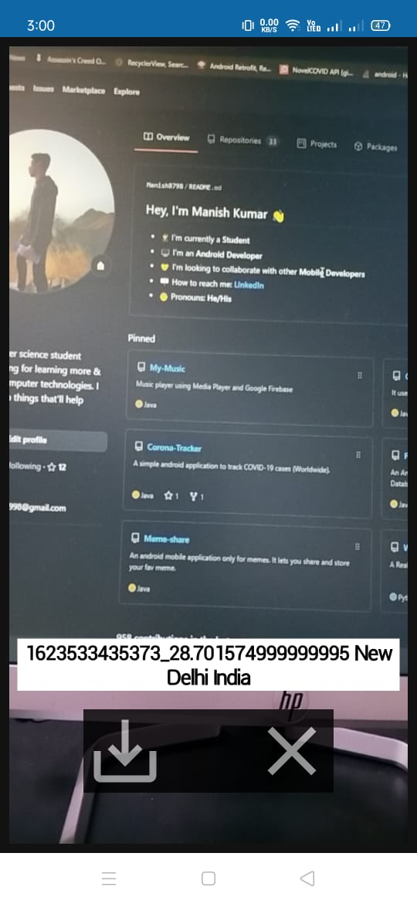
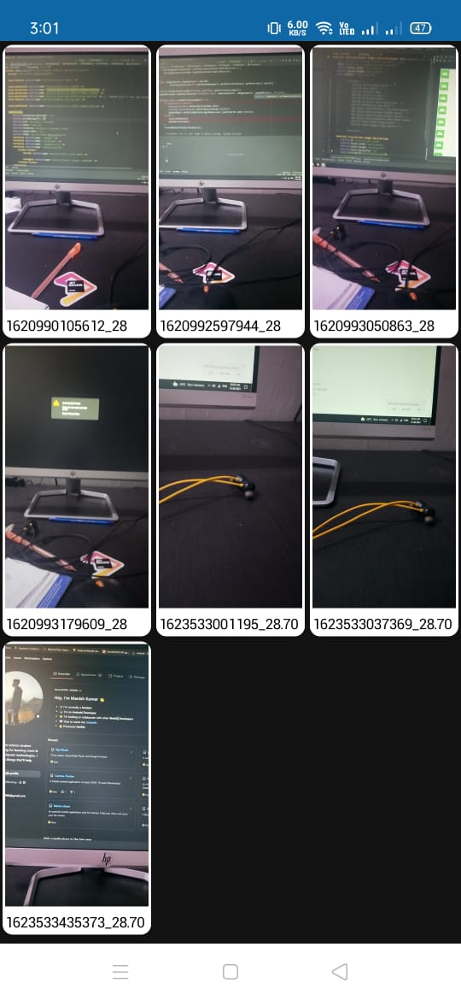

# CameraCL

> - _It uses [CameraX](https://developer.android.com/training/camerax) api to capture images_.
> - _It shows location of captured image and preview of captured image so user can save image in SQLite Database or click again, and on long pressing preview image it will show a toast containing user address_.
> - _Location coordinates saved as image name in database_.
> - _User can zoom in/out saved image_.

 

 

 

